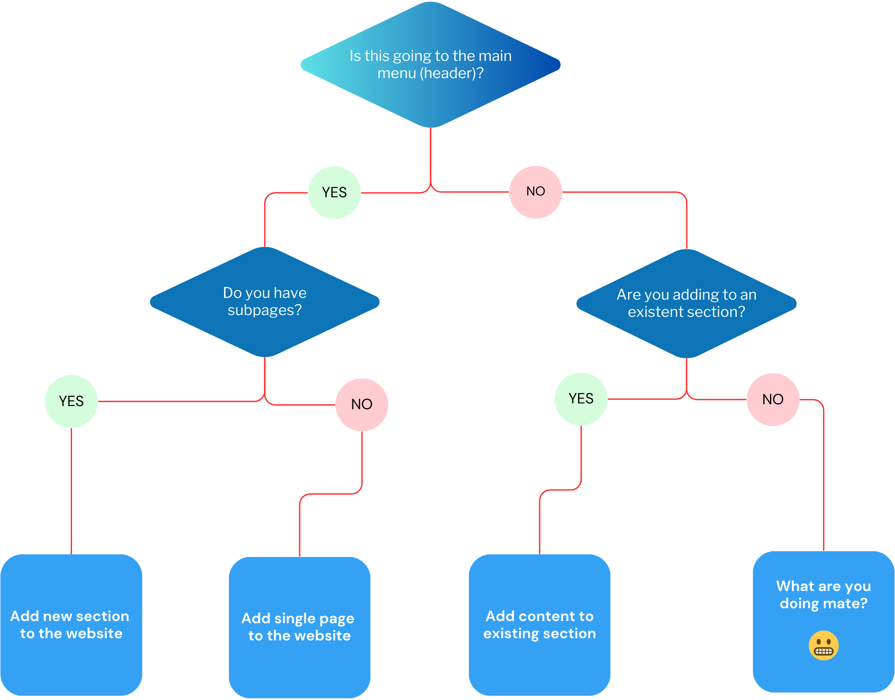

[](https://github.com/Soap2G/atlasopendata-website-v2/actions/workflows/pages/pages-build-deployment)

# The ATLAS Open Data Documentation Website

- **[Installation](#installation)**
    - **[Local Development](#local-development)**
    - **[Build](#build)**
    - **[Deployment](#deployment)**
- **[Structure of the repository](#structure-of-the-repository)** 
- **[How to contribute](#how-to-contribute)**
    - **[Add single page to the website](#add-single-page-to-the-website)**
    - **[Add new section to the website](#add-new-section-to-the-website)**
    - **[Add content to existing section](#add-content-to-existing-section)**


This website is built using [Docusaurus 2](https://docusaurus.io/), a modern static website generator.

## Installation
Get the code on a local repository:
```
git clone https://github.com/Soap2G/atlasopendata-website-v2.git
```
The install the requisites:
```
$ yarn install
```

#### Local Development

```
$ yarn start
```

This command starts a local development server and opens up a browser window. Most changes are reflected live without having to restart the server.

#### Build

```
$ yarn build
```

This command generates static content into the `build` directory and can be served using any static contents hosting service.

#### Deployment

Using SSH:

```
$ USE_SSH=true yarn deploy
```

Not using SSH:

```
$ GIT_USER=<Your GitHub username> yarn deploy
```

If you are using GitHub pages for hosting, this command is a convenient way to build the website and push to the `gh-pages` branch.

---

## Structure of the repository

This website runs on `javascript`. There are 3 main configuration files:
- `./docusaurus.config.js`: general config file containing metadata for the url, deployment informations, cosmetic settings, **main menu settings**, and links for the footer. 
- `./sidebars.js`: is used to build the layout of the sidebars, used for navigation.
- `./src/pages/index.tsx`: encodes the landing page, the very first page of the site.

These contribute to the overall structure of the website. 
On the other hand, the content is stored in: 
- `./static`: contains images and logos for the website layout.
- `./docs`: includes all the relevant information regarding ATLAS Open Data, written in `markddown`.

---

## How to contribute
To add content, it is sufficient to add all the new pages in the `./docs` folder, _**making sure to follow these subsequent steps**_:

<div align="center">



</div>

### Add single page to the website
1. Update the `./docusaurus.config.js` in correcspondence of the `themeConfig:` group; here you must look for `items: []` block, and add the correspoding section to it, e.g.:
```
{
  type: 'docSidebar', // This is a preset normally effective, do not change
  sidebarId: 'intro', // The ID of the corresponding sidebar. Choose the name wisely, this will be needed after.
  position: 'left',
  label: 'Introduction', // The title that will appear on the menu
},
```
This will add a new entry to the main menu in the header.

2. (_optional_) Update the `./sidebars.js` file by adding to the `const sidebars = {}` block something like this:
```
intro: [ // THE NAME OF THE ITEM MUST CORRESPOND TO THE sidebarId CHOSEN BEFORE!!!
  'atlas/lhc'
],
```

### Add new section to the website
1. Update the `./docusaurus.config.js` in correcspondence of the `themeConfig:` group; here you must look for `items: []` block, and add the correspoding section to it, e.g.:
```
{
  type: 'docSidebar', // This is a preset normally effective, do not change
  sidebarId: 'intro', // The ID of the corresponding sidebar. Choose the name wisely, this will be needed after.
  position: 'left',
  label: 'Introduction', // The title that will appear on the menu
},
```
This will add a new entry to the main menu in the header.

2. Update the `./sidebars.js` file by adding to the `const sidebars = {}` block something like this:
```
intro: [ // THE NAME OF THE ITEM MUST CORRESPOND TO THE sidebarId CHOSEN BEFORE!!!
  {
    type: 'category',
    label: 'Introduction', // Title of the section, suggest to use the same used above
    items: [               // List of the pages included in the section, considering as the base path ./docs/
      'atlas/lhc', 
      'atlas/experiment', 
      'atlas/atlas_events'
    ],
  }],
```
### Add content to existing section

Update the `./sidebars.js` file by browsing the `const sidebars = {}` locating the correspoding section. Once found, add the link to the page to the `items: []` list:
```
intro: [ // THE NAME OF THE ITEM MUST CORRESPOND TO THE sidebarId CHOSEN BEFORE!!!
  {
    type: 'category',
    label: 'Introduction', // Title of the section, suggest to use the same used above
    items: [               // List of the pages included in the section, considering as the base path ./docs/
      'atlas/lhc', 
      'atlas/experiment', 
      'atlas/atlas_events',
      'atlas/my_new_page' // <------- ADDED THE NEW PAGE HERE
    ],
  }],
```
Do not forget **commas** where necessary.

